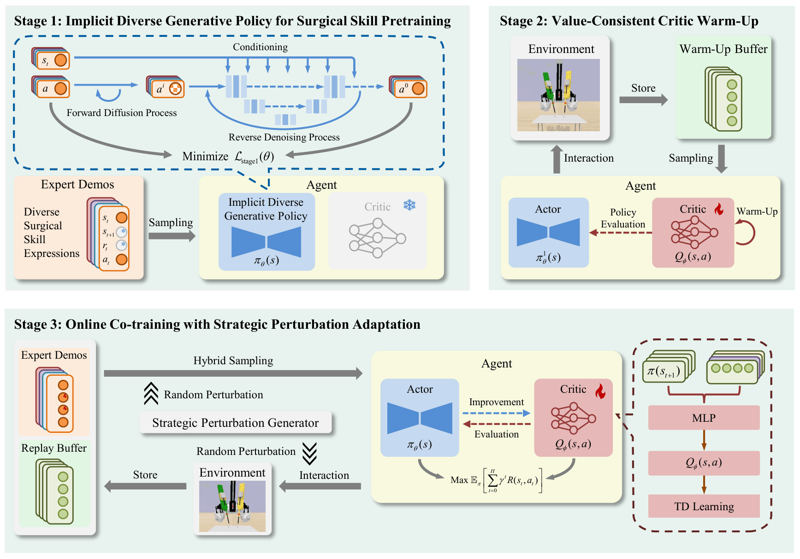

<h1 align="center">DIRA: Diffusion-Based Imitation-to-Reinforcement Adaptation for Task Automation of Surgical Robots</h1>

<p align="center">
  <b>Diffusion policy pretraining, value-consistent critic warm-up, and online imitation-to-reinforcement adaptation for surgical robot automation.</b>
</p>


<p align="center">
  <a href="https://doi.org/10.1109/LRA.2026.3699185">
    
  </a>
  
  <a href="LICENSE">
    
  </a>
</p>

## Overview

This repository contains the DIRA-related reinforcement learning overlay files for:

**DIRA: Diffusion-Based Imitation-to-Reinforcement Adaptation for Task Automation of Surgical Robots**

Accepted by IEEE Robotics and Automation Letters (RA-L), 2026.

DIRA is a three-stage framework for surgical robot task automation:

1. **Implicit diverse generative policy pretraining** with a conditional diffusion policy.
2. **Value-consistent critic warm-up** to stabilize value estimation before online policy updates.
3. **Online imitation-reinforcement co-training** with Strategic Perturbation Generator (SPG).

## Framework

<p align="center">
  
</p>

## Repository Structure

```text
DIRA/
├── README.md
├── LICENSE
├── .gitignore
├── assets/
│   └── figures/
└── rl/
    ├── agents/
    ├── configs/
    ├── modules/
    ├── components/
    └── utils/
```

## Preparation

Clone the required external projects separately:

```bash
git clone https://github.com/med-air/SurRoL.git
git clone https://github.com/Junda24/MonSter.git MonSter-main
git clone https://github.com/NVlabs/FoundationPose.git FoundationPose
```

Install and configure the environment following the corresponding project instructions. DIRA follows the SurRoL/DEX-style training entrypoints and expects demonstration files to be passed with `demo_path`.

## Use DIRA with SurRoL

Copy the DIRA overlay files into your SurRoL checkout:

```bash
cp -r DIRA/rl/* SurRoL/rl/
```

Register the `DIRA` and `DIRT` agents in your local SurRoL agent factory if they are not already listed there. Then run training in the SurRoL root directory:

```bash
python3 rl/train.py task=NeedlePick-v0 agent=dira demo_path=/path/to/demo.npz use_wb=False
```

For the earlier DIRT variant:

```bash
python3 rl/train.py task=NeedlePick-v0 agent=dirt demo_path=/path/to/demo.npz use_wb=False
```

## Citation

```bibtex
@ARTICLE{wang2026dira,
  author={Wang, Guowei and Sun, Xinan and Xing, Yuan and Cao, Rui and Ma, Zhikang and Zhang, Xuan},
  journal={IEEE Robotics and Automation Letters},
  title={DIRA: Diffusion-Based Imitation-to-Reinforcement Adaptation for Task Automation of Surgical Robots},
  year={2026},
  doi={10.1109/LRA.2026.3699185}
}
```

## Acknowledgements

This implementation builds on the SurRoL surgical robot learning platform and diffusion policy style action generation. We also refer users to MonSter and FoundationPose for the real-world demonstration processing pipeline described in the paper.
